# Getting Started with SharePoint Framework Extensions

In this lab you work with the SharePoint Framework to extend the user interface with extensions. This includes: application customers, field customizers and command sets.

## In this lab

- [Introduction to Extensions & Application Customizer](#exercise1)
- [Field Customizers](#exercise2)
- [List View Command Sets](#exercise3)

## Prerequisites

To complete this lab, you need the following:

- Office 365 tenancy
  > If you do not have one, you obtain one (for free) by signing up to the [Office 365 Developer Program](https://developer.microsoft.com/office/dev-program).
- Local SharePoint Framework development environment installed and configured
  - Refer to the SharePoint Framework documentation, specifically the **[Getting Started > Set up development environment](https://docs.microsoft.com/sharepoint/dev/spfx/set-up-your-development-environment)** for the most current steps

<a name="exercise1"></a>

## Exercise 1: Introduction to Extensions & Application Customizer

In this exercise you will create a SharePoint Framework (SPFx) application customizer extension.

1. Open a command prompt and change to the folder where you want to create the project.
1. Run the SharePoint Yeoman generator by executing the following command:

    ```shell
    yo @microsoft/sharepoint
    ```

    Use the following to complete the prompt that is displayed:

    - **What is your solution name?**: SPFxAppCustomizer
    - **Which baseline packages do you want to target for your component(s)?**: SharePoint Online only (latest)
    - **Where do you want to place the files?**: Use the current folder
    - **Do you want to allow the tenant admin the choice of being able to deploy the solution to all sites immediately without running any feature deployment or adding apps in sites?**: No
    - **Will the components in the solution require permissions to access web APIs that are unique and not shared with other components in the tenant?**: No
    - **Which type of client-side component to create?**: Extension
    - **What type of client-side extension to create?**: Application Customizer
    - **What is your Application Customizer name?**: HelloAppCustomizer
    - **What is your Application Customizer description?**: HelloAppCustomizer description

    After provisioning the folders required for the project, the generator will install all the dependency packages using NPM.

1. When NPM completes downloading all dependencies, test the default project provisioned by the generator.

    Extensions must be tested in a modern SharePoint page unlike web parts which can be tested in the local workbench. In addition, extensions also require special URL parameters when requesting the page to load the extension from the local development web server.
    1. Obtain the URL of a modern SharePoint page.
    1. Open the **./config/serve.json** file.
    1. Copy in the URL of your modern SharePoint page into the `serveConfigurations.default.pageUrl` property.

        > *The SPFx build process' gulp **serve** task will launch a browser and navigate to this URL, appending the necessary URL parameters to the end of the URL to load the SPFx extension from your local development web server.*

    1. Run the project by executing the following command:

        ```shell
        gulp serve
        ```

    1. When the SharePoint page loads, SharePoint will prompt you to load the debug scripts. This is a confirmation check to ensure you really want to load scripts from an untrusted source. In this case, that is your local development web server on **https://localhost** which you can trust.

        Select the button **Load debug scripts**.

        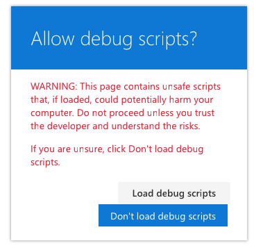

    1. Once the scripts load, a SharePoint dialog alert box will be shown:

        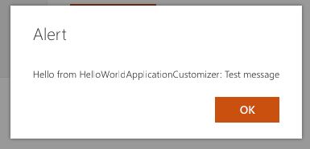

        This alert box is shown by the application customizer. Open the application customizer file located at **./src/extensions/helloAppCustomizer/HelloAppCustomizerApplicationCustomizer.ts** and find the `OnInit()` method. Notice the following line in the method that is triggering the dialog to appear:

        ```ts
        Dialog.alert(`Hello from ${strings.Title}:\n\n${message}`);
        ```

1. Stop the local web server by pressing <kbd>CTRL</kbd>+<kbd>C</kbd> in the console/terminal window.

### Update App Customizer to Add Placeholders to the Page

In this step you will modify the application customizer to write some pre-defined text to the top and bottom placeholders on the page.

1. Update the public properties of the application customizer:
    1. Update the customizer to have two public settable properties.
        1. Locate and open the **./src/extensions/helloAppCustomizer/HelloAppCustomizerApplicationCustomizer.ts** file.
        1. Locate the **IHelloAppCustomizerApplicationCustomizerProperties** interface.
        1. Change the interface so it has only two properties:

            ```ts
            header: string;
            footer: string;
            ```

    1. Update the properties for the serve configuration used to test and debug the extension:
        1. Locate and open the **./config/serve.json** file.
        1. Locate the `serveConfigurations.default.properties` object.
        1. Change the value of the `properties` object to the following:

            ```json
            "properties": {
              "header": "Header area of the page",
              "footer": "Footer area of the page"
            }
            ```

    1. Update the properties in the files used in production deployment of the extension:
        1. Locate and open the **./sharepoint/assets/elements.xml** file.

            > This is used when installing the extension in a single SharePoint site collection.

        1. Set the `ClientSideComponentProperties` property to the following HTML encoded JSON string that contains the public property values:

            ```xml
            {&quot;header&quot;:&quot;Header area of the page&quot;,&quot;footer&quot;:&quot;Footer area of the page&quot;}
            ```

        1. Locate and open the **./sharepoint/assets/ClientSideInstance.xml** file.

            > This is used when the extension is used in tenant wide deployment scenarios.

        1. Set the `Properties` property to the following HTML encoded JSON string that contains the public property values:

            ```xml
            {&quot;header&quot;:&quot;Header area of the page&quot;,&quot;footer&quot;:&quot;Footer area of the page&quot;}
            ```

1. Add CSS styles to the application customizer:
    1. Install the SPFx version of the Office UI Fabric Code CSS files by executing the following on the command line:

        ```shell
        npm install @microsoft/sp-office-ui-fabric-core --save
        ```

    1. Create a new file **HelloAppCustomizerApplicationCustomizer.module.scss** to the **./src/helloAppCustomizer** folder and copy in the following SCSS code:

        ```scss
        @import '~@microsoft/sp-office-ui-fabric-core/dist/sass/SPFabricCore.scss';

        .app {
          .top {
            height:60px;
            text-align:center;
            line-height:2.5;
            font-weight:bold;
            display: flex;
            align-items: center;
            justify-content: center;
            background-color: $ms-color-themePrimary;
            color: $ms-color-white;
          }

          .bottom {
            height:40px;
            text-align:center;
            line-height:2.5;
            font-weight:bold;
            display: flex;
            align-items: center;
            justify-content: center;
            background-color: $ms-color-themePrimary;
            color: $ms-color-white;
          }
        }
        ```

    1. Locate and open the **./src/extensions/helloAppCustomizer/HelloAppCustomizerApplicationCustomizer.ts** file.
    1. Add the following import statements to the top of the page:

        ```ts
        import styles from './HelloAppCustomizerApplicationCustomizer.module.scss';
        import { escape } from '@microsoft/sp-lodash-subset';
        ```

1. Update application customizer for working with placeholders on the page:
    1. Locate and open the **./src/extensions/helloAppCustomizer/HelloAppCustomizerApplicationCustomizer.ts** file.
    1. Locate the existing `import` statement for the `@microsoft/sp-application-base` library.
    1. Update the list of imports to add the following: `PlaceholderContent` & `PlaceholderName`.
    1. Within the `HelloAppCustomizerApplicationCustomizer` class, add the following two private members:

        ```ts
        private _topPlaceholder: PlaceholderContent | undefined;
        private _bottomPlaceholder: PlaceholderContent | undefined;
        ```

1. Update the header & footer placeholder on the page:
    1. Add a new method to the `HelloAppCustomizerApplicationCustomizer` class. This is used when the placeholders are disposed.

        ```ts
        private _onDispose(): void {
          console.log('[HelloWorldApplicationCustomizer._onDispose] Disposed custom top and bottom placeholders.');
        }
        ```

    1. Add a new method to the `HelloAppCustomizerApplicationCustomizer` class:

        ```ts
        private _renderPlaceHolders(): void {
          console.log('Available application customizer placeholders: ',
            this.context.placeholderProvider.placeholderNames
              .map((name) => PlaceholderName[name])
              .join(', ')
          );
        }
        ```

    1. Add the following code to the `_renderPlaceHolders()` method. This will obtain a handle to the top placeholder on the page. It will then add some markup to the placeholder using the message defined in the public property:

        ```ts
        if (!this._topPlaceholder) {
          this._topPlaceholder = this.context.placeholderProvider.tryCreateContent(
            PlaceholderName.Top,
            { onDispose: this._onDispose }
          );

          if (!this._topPlaceholder) {
            console.error('The expected placeholder (Top) was not found.');
            return;
          }

          if (this.properties) {
            let headerMessage: string = this.properties.header;
            if (!headerMessage) {
              headerMessage = '(header property was not defined.)';
            }

            if (this._topPlaceholder.domElement) {
              this._topPlaceholder.domElement.innerHTML = `
                <div class="${styles.app}">
                  <div class="${styles.top}">
                    <i class="ms-Icon ms-Icon--Info" aria-hidden="true"></i> ${escape(headerMessage)}
                  </div>
                </div>`;
            }
          }
        }
        ```

    1. Add the following code to the `_renderPlaceHolders()` to update the bottom placeholder:

        ```ts
        if (!this._bottomPlaceholder) {
          this._bottomPlaceholder = this.context.placeholderProvider.tryCreateContent(
            PlaceholderName.Bottom,
            { onDispose: this._onDispose }
          );

          if (!this._bottomPlaceholder) {
            console.error('The expected placeholder (Bottom) was not found.');
            return;
          }

          if (this.properties) {
            let footerMessage: string = this.properties.footer;
            if (!footerMessage) {
              footerMessage = '(footer property was not defined.)';
            }

            if (this._bottomPlaceholder.domElement) {
              this._bottomPlaceholder.domElement.innerHTML = `
                <div class="${styles.app}">
                  <div class="${styles.bottom}">
                    <i class="ms-Icon ms-Icon--Info" aria-hidden="true"></i> ${escape(footerMessage)}
                  </div>
                </div>`;
            }
          }
        }
        ```

1. Update the app customizer to display the placeholders:
    1. Replace the code in the `onInit()` method with the following code:

        ```ts
        Log.info(LOG_SOURCE, `Initialized ${strings.Title}`);

        this.context.placeholderProvider.changedEvent.add(this, this._renderPlaceHolders);

        return Promise.resolve();
        ```

### Test the Application Customizer

1. Run the project by executing the following command:

    ```shell
    gulp serve
    ```

1. When prompted, select the **Load debug scripts** button.
1. Notice when the page loads, the text defined in the public properties is displayed in the header and footer of the page:

    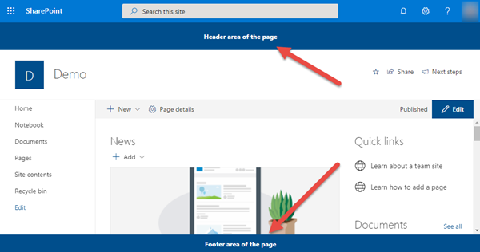

1. Stop the local web server by pressing <kbd>CTRL</kbd>+<kbd>C</kbd> in the console/terminal window.

### Deploy the Application Customizer to all Sites in the SharePoint Online Tenant

In this step you will deploy the application customizer to your entire SharePoint tenant.

1. Locate and open the **./config/package-solution.json** file.
    1. Ensure the `solution` object has a property named `skipFeatureDeployment` and ensure that the value of this property is set to **true**. 
1. Locate and open the **./sharepoint/assets/ClientSideInstance.xml** file. This file contains the values that will be automatically set on the **Tenant Wide Extensions** list in your SharePoint Online tenant's App Catalog site when the package is deployed.
1. Build and package the solution by running the following commands one at a time:

    ```shell
    gulp build
    gulp bundle --ship
    gulp package-solution --ship
    ```

1. In the browser, navigate to your SharePoint Online's tenant **App Catalog** site.
    1. Select the **Apps for SharePoint** list in the left-hand navigation.
    1. Drag the generated **./sharepoint/solution/*.sppkg** file into the **Apps for SharePoint** list.
    1. In the **Do you trust spfx-app-customizer-client-side-solution?** dialog...
        1. Select the checkbox **Make this solution available to all sites in the organization**
        1. Notice the message **This package contains an extension which will be automatically enabled across sites...**.
        1. Select **Deploy**.

        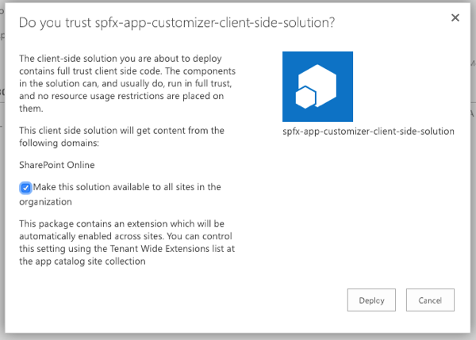

    1. Select **Site contents** in the left-hand navigation.
    1. Select **Tenant Wide Extensions**. Depending on when your tenant was created the **Tenant Wide Extensions** list may be hidden. If
    you do not see the list in the Site Contents then you will have to navigate to it manually. Do this by appending `/Lists/TenantWideExtensions/AllItems.aspx` to the URL of the app catalog site.

        

    1. Notice the application customizer is present, with the specified properties, in the list:

        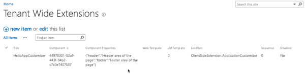

1. In a separate browser window, navigate to any modern page in any modern site within your SharePoint Online tenant. You should see the extension appear in the tenant.

> *NOTE: It may take up to 20 minutes for a tenant-wide extension to get deployed across the SharePoint online tenant so you may need to wait to fully test your deployment was successful.*

1. Stop the local web server by pressing <kbd>CTRL</kbd>+<kbd>C</kbd> in the console/terminal window.

<a name="exercise2"></a>

## Exercise 2: Field Customizers

In this exercise you will create a SharePoint Framework (SPFx) field customizer extension that will display a colored bar in a column with a percentage of the bar filled depending on the value in the field.

1. Open a command prompt and change to the folder where you want to create the project.
1. Run the SharePoint Yeoman generator by executing the following command:

    ```shell
    yo @microsoft/sharepoint
    ```

    Use the following to complete the prompt that is displayed:

    - **What is your solution name?**: SPFxFieldCustomizer
    - **Which baseline packages do you want to target for your component(s)?**: SharePoint Online only (latest)
    - **Where do you want to place the files?**: Use the current folder
    - **Do you want to allow the tenant admin the choice of being able to deploy the solution to all sites immediately without running any feature deployment or adding apps in sites?**: No
    - **Which type of client-side component to create?**: Extension
    - **What type of client-side extension to create?**: Field Customizer
    - **What is your Field Customizer name?**: HelloFieldCustomizer
    - **What is your Field Customizer description?**: HelloFieldCustomizer description
    - **Which framework would you like to use?**: No JavaScript Framework

    After provisioning the folders required for the project, the generator will install all the dependency packages using NPM.

1. Update the SCSS styles for the field customizer:
    1. Locate and open the **./src/extensions/helloFieldCustomizer/HelloFieldCustomizerFieldCustomizer.module.scss** file.
    1. Replace the contents of the file with the following styles:

        ```scss
        .HelloFieldCustomizer {
          .cell {
            display: 'inline-block';
          }
          .filledBackground {
            background-color: #cccccc;
            width: 100px;
          }
        }
        ```

1. Update the code for the field customizer:
    1. Locate and open the **./src/extensions/helloFieldCustomizer/HelloFieldCustomizerFieldCustomizer.ts** file.
    1. Locate the interface `IHelloFieldCustomizerFieldCustomizerProperties` and update it's properties to the following:

        ```ts
        greenMinLimit?: string;
        yellowMinLimit?: string;
        ```

    1. Locate the method `onRenderCell()` and update the contents to match the following code. This code looks at the existing value in the field and builds the relevant colored bars based on the value entered in the completed percentage value.

        ```ts
        event.domElement.classList.add(styles.cell);

        // determine color & text to use
        const fieldValue = parseInt(event.fieldValue);
        let filledColor: string = '';

        if (isNaN(fieldValue) || fieldValue === 0) {
          event.domElement.innerHTML = `
            <div class="${styles.HelloFieldCustomizer}">
              <div class="">
                <div style="width: 100px; color:#000000;">
                  &nbsp; no progress
                </div>
              </div>
            </div>
          `;
        } else {
          if (fieldValue >= parseInt(this.properties.greenMinLimit)) {
            filledColor = '#00ff00';
          } else if (fieldValue >= parseInt(this.properties.yellowMinLimit)) {
            filledColor = '#ffff00';
          } else {
            filledColor = '#ff0000';
          }

          event.domElement.innerHTML = `
            <div class="${styles.HelloFieldCustomizer}">
              <div class="${styles.filledBackground}">
                <div style="width: ${fieldValue}px; background:${filledColor}; color:#000000;">
                  &nbsp; ${fieldValue}% completed
                </div>
              </div>
            </div>`;
        }
        ```

1. Update the deployment code for the field customizer:

    Field customizers, when deployed to production, are implemented by creating a new site column who's rendering is tied to the custom script defined in the field customizer's bundle file.

    1. Locate and open the **./sharepoint/assets/elements.xml** file.
    1. Add the following property to the `<Field>` element, setting the values on the public properties on the field customizer:

        ```xml
        ClientSideComponentProperties="{&quot;greenMinLimit&quot;:&quot;85&quot;,&quot;yellowMinLimit&quot;:&quot;70&quot;}"
        ```

1. Test the field customizer:
    1. In a browser, navigate to a SharePoint Online modern site collection where you want to test the field customizer.
    1. Select the **Site contents** link in the left-hand navigation.
    1. Create a new SharePoint list:
        1. Select **New > List** in the toolbar.
        1. Set the list name to **Work Status** and select **Create**.

            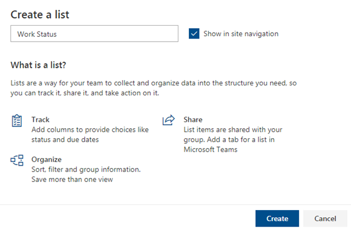

        1. When the list loads, select the **Add column > Number** to create a new column.

            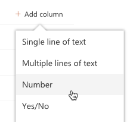

        1. When prompted for the name of the column, enter **PercentComplete**.
        1. Add a few items to the list, such as the following:

            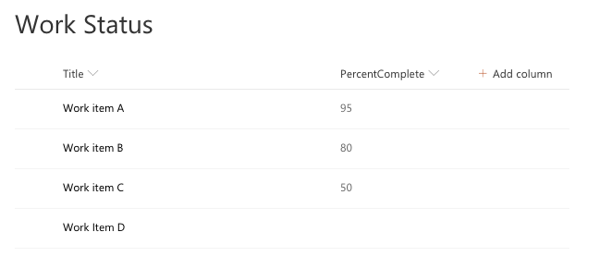

    1. Update the properties for the serve configuration used to test and debug the extension:
        1. Locate and open the **./config/serve.json** file.
        1. Copy in the full URL (including **AllItems.aspx**) of the list you just created into the `serveConfigurations.default.pageUrl` property.
        1. Locate the `serveConfigurations.default.properties` object.
        1. Change the name of the property `serveConfigurations.default.fieldCustomizers.InternalFieldName` to `serveConfigurations.default.fieldCustomizers.PercentComplete`. This tells the SharePoint Framework which existing field to associate the field customizer with.
        1. Change the value of the `properties` object to the following:

            ```json
            "properties": {
              "greenMinLimit": "85",
              "yellowMinLimit": "70"
            }
            ```

            > NOTE: You do not need to change the value of the `id` property.

            The JSON for the default serve configuration should look something like the following:

            ```json
            "default": {
              "pageUrl": "https://contoso.sharepoint.com/sites/mySite/Lists/Work%20Status/AllItems.aspx",
              "fieldCustomizers": {
                "PercentComplete": {
                  "id": "6a1b8997-00d5-4bc7-a472-41d6ac27cd83",
                  "properties": {
                    "greenMinLimit": "85",
                    "yellowMinLimit": "70"
                  }
                }
              }
            }
            ```

    1. Run the project by executing the following command:

        ```shell
        gulp serve
        ```

    1. When prompted, select the **Load debug scripts** button.
    1. Notice when the page loads, notice how the rendering has changed according to the code in your field customizer:

        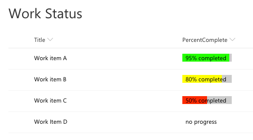

1. Stop the local web server by pressing <kbd>CTRL</kbd>+<kbd>C</kbd> in the console/terminal window.

<a name="exercise3"></a>

## Exercise 3: List View Command Sets

In this exercise you will create a SharePoint Framework (SPFx) command set extension that will display a few buttons in a SharePoint list.

1. Open a command prompt and change to the folder where you want to create the project.
1. Run the SharePoint Yeoman generator by executing the following command:

    ```shell
    yo @microsoft/sharepoint
    ```

    Use the following to complete the prompt that is displayed:

    - **What is your solution name?**: SPFxCommandSet
    - **Which baseline packages do you want to target for your component(s)?**: SharePoint Online only (latest)
    - **Where do you want to place the files?**: Use the current folder
    - **Do you want to allow the tenant admin the choice of being able to deploy the solution to all sites immediately without running any feature deployment or adding apps in sites?**: No
    - **Which type of client-side component to create?**: Extension
    - **What type of client-side extension to create?**: ListView Command Set
    - **What is your Command Set name?**: CommandSetDemo
    - **What is your Command Set description?**: CommandSetDemo description

    After provisioning the folders required for the project, the generator will install all the dependency packages using NPM.

1. Define the command set buttons to add to the SharePoint list.
    1. Locate and open the **./src/extensions/commandSetDemo/CommandSetDemoCommandSet.manifest.json** file.
    1. Add the following markup to the end of the file, just before the closing `}`:

        ```json
        "items": {
          "ONE_ITEM_SELECTED": {
            "title": { "default": "One Item Selected" },
            "iconImageUrl": "icons/request.png",
            "type": "command"
          },
          "TWO_ITEM_SELECTED": {
            "title": { "default": "Two Items Selected" },
            "iconImageUrl": "icons/cancel.png",
            "type": "command"
          },
          "ALWAYS_ON": {
            "title": { "default": "Always On" },
            "iconImageUrl": "icons/cancel.png",
            "type": "command"
          }
        }
        ```

1. Update the command set code:
    1. Locate and open the **./src/extensions/commandSetDemo/CommandSetDemoCommandSet.ts** file.
    1. Locate the interface `ICommandSetDemoCommandSetProperties` and update it's members to the following:

        ```ts
        messagePrefix: string;
        ```

    1. Locate the method `onListViewUpdated()` in the `CommandSetDemoCommandSet` class and replace it's contents with the following code. This will show / hide two of the buttons depending on the number of items selected in the list:

        ```ts
        const one_item_selected: Command = this.tryGetCommand('ONE_ITEM_SELECTED');
        if (one_item_selected) {
          one_item_selected.visible = event.selectedRows.length === 1;
        }
        const two_item_selected: Command = this.tryGetCommand('TWO_ITEM_SELECTED');
        if (two_item_selected) {
          two_item_selected.visible = event.selectedRows.length === 2;
        }
        ```

    1. Locate the method `onExecute()` in the `CommandSetDemoCommandSet` class and replace it's contents with the following code. This controls what happens when custom button is selected:

        ```ts
        switch (event.itemId) {
          case 'ONE_ITEM_SELECTED':
            Dialog.alert(`${this.properties.messagePrefix} ONE_ITEM_SELECTED command checked; Title = ${event.selectedRows[0].getValueByName('Title')}`);
            break;
          case 'TWO_ITEM_SELECTED':
            Dialog.alert(`${this.properties.messagePrefix} TWO_ITEM_SELECTED command checked; Title = ${event.selectedRows[event.selectedRows.length-1].getValueByName('Title')}`);
            break;
          case 'ALWAYS_ON':
            Dialog.alert(`${this.properties.messagePrefix} ALWAYS_ON command checked. Total selected: ${event.selectedRows.length}`);
            break;
          default:
            throw new Error('Unknown command');
        }
        ```

1. Update the deployment code for the command set:

    Command sets, when deployed to production, are implemented by provisioning a new custom action that is associated with the custom script defined in the command set's bundle file.

    1. Locate and open the **./sharepoint/assets/elements.xml** file.
    1. Update the following property to the `<CustomAction>` element, setting the values on the public properties on the command set:

        ```xml
        ClientSideComponentProperties="{&quot;messagePrefix&quot;:&quot;[command_set_prefix]&quot;}"
        ```

1. Test the command set:
    1. In a browser, navigate to a SharePoint Online modern site collection where you want to test the field customizer.
    1. Select the **Site contents** link in the left-hand navigation.
    1. Select the list **Work Status** created in the last exercise:

        

    1. Update the properties for the serve configuration used to test and debug the extension:
        1. Locate and open the **./config/serve.json** file.
        1. Copy in the full URL (including **AllItems.aspx**) of the list `serveConfigurations.default.pageUrl` property.
        1. Locate the `serveConfigurations.default.customActions.properties` object.
        1. Change the value of the `properties` object to the following:

            ```json
            "properties": {
              "messagePrefix": "[command_set_prefix]"
            }
            ```

    1. Run the project by executing the following command:

        ```shell
        gulp serve
        ```

    1. When prompted, select the **Load debug scripts** button.
    1. Notice when the page loads, notice a new button in the toolbar. When the **Always On** button is selected, a dialog appears displaying the message prefix defined in the public properties as well as the total number of items selected.

        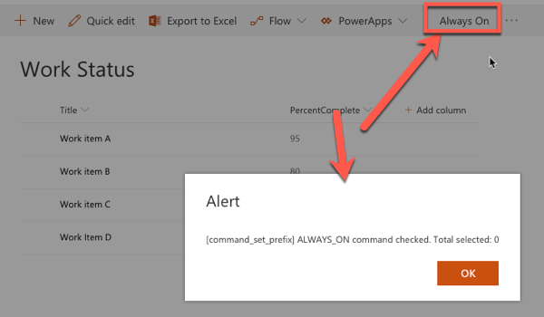

    1. Select one item in the list. Notice a new button appears. Select the button and notice how the dialog has changed:

        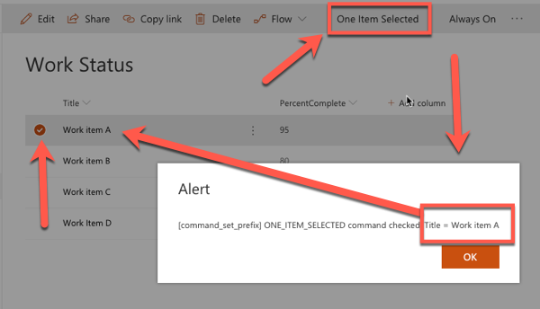

    1. Select a second item in the list. Notice a new button appears. Select the button and notice how the dialog has changed:

        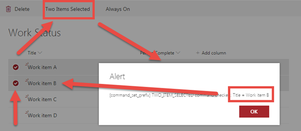

1. Stop the local web server by pressing <kbd>CTRL</kbd>+<kbd>C</kbd> in the console/terminal window.
